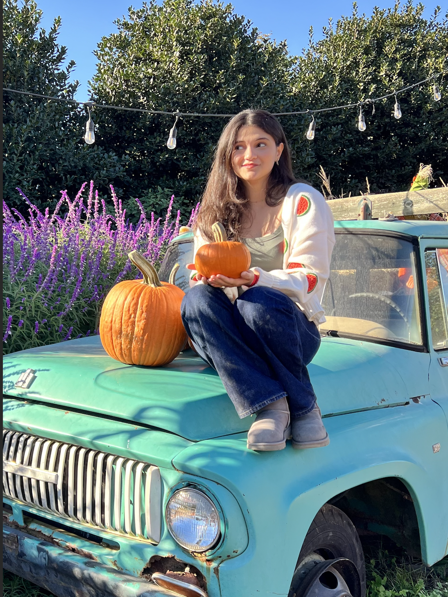

  <h1 style="font-size: 36px; font-weight: bold; margin-bottom: 10px;">✨ Welcome to Yasmein's Portfolio ✨</h1>

  

    <a href="#projects" style="background-color: #8B82F7; color: white; padding: 10px 20px; text-decoration: none; border-radius: 5px;">Projects</a>
    <a href="#experience" style="background-color: #D3C4FF; color: white; padding: 10px 20px; text-decoration: none; border-radius: 5px;">Experience</a>
    <a href="#skills" style="background-color: #AA9CED; color: white; padding: 10px 20px; text-decoration: none; border-radius: 5px;">Skills</a>
  

  <h2 style="font-size: 28px; color: #6E5494;">About me</h2>
  

    

      Yasmein Asfour is a sophomore from Chicago, Illinois. She is Palestinian-American and pursuing a major in Computer Engineering. She is interested in joining organizations such as the Society of Women Engineers, Engineers Without Borders, Institute of Electrical and Electronic Engineering, and the Muslim Student Association. Having traveled and lived abroad for several years, Yasmein looks forward to participating in the Study Abroad program in either Korea or London. She is enthusiastic about living in DC and hopes to learn more about the historical significance it holds.
    

   
  

<!-- Projects Section -->

  <h2 style="font-size: 28px; color: #6E5494;">🚀 My Projects</h2>
  <ul style="list-style: none; padding: 0; text-align: left; font-size: 16px;">
    <li>🌟 iPad Docking Station</li>
    <li>🌟 Solar Portable Charger</li>
    <li>🌟 Arduino-Controlled Racecar</li>
    <li>🌟 8-bit Shift Register</li>
  </ul>

<!-- Experience Section -->

  <h2 style="font-size: 28px; color: #6E5494;">💼 Professional Experience</h2>
  <ul style="list-style: none; padding: 0; text-align: left; font-size: 16px;">
    <li><strong>Data Science & AI Intern (Zain Group)</strong> – Jul 2024 - Aug 2024</li>
    <li><strong>Python Intern (Sitech)</strong> – Jul 2023 - Oct 2023</li>
    <li><strong>Engineering Intern (Omrania & Associates)</strong> – May 2021 - Aug 2021</li>
  </ul>

<!-- Skills Section -->

  <h2 style="font-size: 28px; color: #6E5494;">🛠 Skills</h2>
  

    Python, C, Java, JavaScript, HTML, CSS, Soldering, Arduino, CAD (Onshape), MATLAB, PCB Assembly
  

