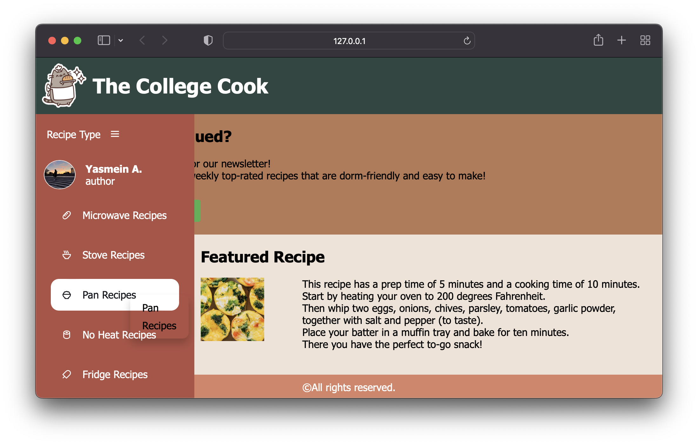

<!DOCTYPE html>
<html>
<head>
  <meta charset="UTF-8">
  <meta name="viewport" content="width=device-width, initial-scale=1.0">
  
  <link rel="stylesheet" href="https://cdnjs.cloudflare.com/ajax/libs/aos/2.3.4/aos.css" />
  
</head>
<body>
  <!-- Header Section -->
  

    <h1 style="font-size: 36px; font-weight: bold; margin-bottom: 10px;">Yasmein Asfour</h1>
  

  <!-- Typing Animation -->
  

    
  

  

    
  

  <!-- Navigation -->
  

    

      <a href="#projects" class="nav-button" style="background-color: #8B82F7;">Projects</a>
      <a href="#experience" class="nav-button" style="background-color: #D3C4FF;">Experience</a>
      <a href="#skills" class="nav-button" style="background-color: #AA9CED;">Hobbies</a>
    

  

  <!-- About Section -->
  

    <h2 style="font-size: 28px; color: #6E5494;">About me</h2>
    

      

        Yasmein Asfour is a sophomore from Chicago, Illinois. She is Palestinian-American and pursuing a major in Computer Engineering. She is interested in joining organizations such as the Society of Women Engineers, Engineers Without Borders, Institute of Electrical and Electronic Engineering, and the Muslim Student Association. Having traveled and lived abroad for several years, Yasmein looks forward to participating in the Study Abroad program in either Korea or London. She is enthusiastic about living in DC and hopes to learn more about the historical significance it holds.
      

      
    

  

  <!-- Projects Section -->
  

    <h2 style="font-size: 28px; color: white; text-align: center;">My Projects</h2>
    

      <!-- iPod Docking Station -->
      

        
        
<a href="https://docs.google.com/document/d/1XPVfb4n8_hlz0ms9uymJM3RGUcBjYHxe/edit" target="_blank" style="color: white; text-decoration: none;">iPod Docking Station Documentation</a>

      

      <!-- 8-bit Shift Register -->
   

        
        
<a href="https://docs.google.com/document/d/1jbeXDu222RakOfukz-txorC6X8JEGipzEZ5wkPgFPtM/edit" target="_blank" style="color: white; text-decoration: none;">8-bit Shift Register Documentation</a>

      

      <!-- SRAD Flight Computer -->
   

        
        
<a href="https://docs.google.com/document/d/1NXahZG1kMCwJgoy31Wl9p9HfCBf4LhcvIHkZc0R1yKk/edit" target="_blank" style="color: white; text-decoration: none;">SRAD Flight Computer Documentation</a>

      

    

  

  <!-- Experience Section -->
  

    <h2 style="font-size: 28px; color: #6E5494; text-align: center;">Professional Experience</h2>
    

      
      <!-- Zain Group -->
   

        <h3>
          <strong>
            <a href="https://zain.com/en" target="_blank" style="color: #6E5494; text-decoration: none;">
              Data Science & AI Intern (Zain Group)
            </a>
          </strong>
        </h3>
        
Jul 2024 - Aug 2024

        

          
          
          
        

        <ul style="font-size: 16px; color: #6E5494; text-align: left; margin: 0 auto; max-width: 90%;">
          <li>Utilized Python, Tableau, and APIs to clean, organize, and visually present large datasets.</li>
          <li>Built a churn prediction model using machine learning techniques.</li>
          <li>Presented weekly data analysis findings to the marketing team.</li>
        </ul>
      

      <!-- Sitech -->
   

        <h3>
          <strong>
            <a href="https://www.sitech.me/" target="_blank" style="color: #6E5494; text-decoration: none;">
              Python Intern (Sitech)
            </a>
          </strong>
        </h3>
        
Jul 2023 - Oct 2023

        

          
          
        

        <ul style="font-size: 16px; color: #6E5494; text-align: left; margin: 0 auto; max-width: 90%;">
          <li>Led frontend development for "The College Cook" web app using JavaScript, HTML5, and CSS3.</li>
          <li>Collaborated on backend development using Python and Django.</li>
          <li>Encouraged collaborative coding among teammates for efficient project completion.</li>
        </ul>
      

      <!-- Omrania -->
   

        <h3>
          <strong>
            <a href="https://omrania.com/" target="_blank" style="color: #6E5494; text-decoration: none;">
              Engineering Intern (Omrania & Associates)
            </a>
          </strong>
        </h3>
        
May 2021 - Aug 2021

        

          
          
        

        <ul style="font-size: 16px; color: #6E5494; text-align: left; margin: 0 auto; max-width: 90%;">
          <li>Collaborated with engineers on project planning, design, and implementation.</li>
          <li>Delivered a comprehensive project status presentation for an ongoing initiative.</li>
        </ul>
      

    

  

  <!-- Skills/Hobbies Section -->
  

    <h2 style="font-size: 28px; color: #6E5494; text-align: center;">🛠 Hobbies</h2>
    

      I am a dedicated rocket science enthusiast and currently lead the avionics team for GW Rocket. I am overseeing a project to develop an SRAD flight computer, where I established five specialized teams to handle various aspects of the design and implementation. My role involves creating the project outline, delegating tasks, ensuring progress stays on schedule, and providing technical guidance. I also mentor sophomores and freshmen, teaching them coding concepts, assisting with debugging, and ensuring they have a strong understanding of the work before contributing to the project.
    

    

      
      
      
    

  

  <script>
    // Initialize AOS
    document.addEventListener('DOMContentLoaded', function() {
      AOS.init({
        duration: 1000,
        once: true,
        offset: 100
      });
    });
